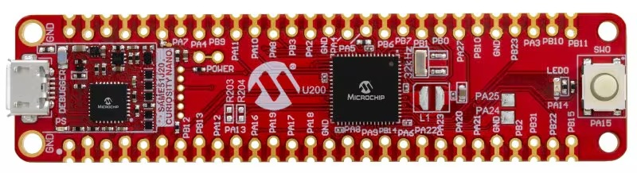
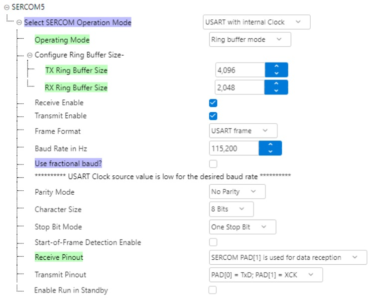
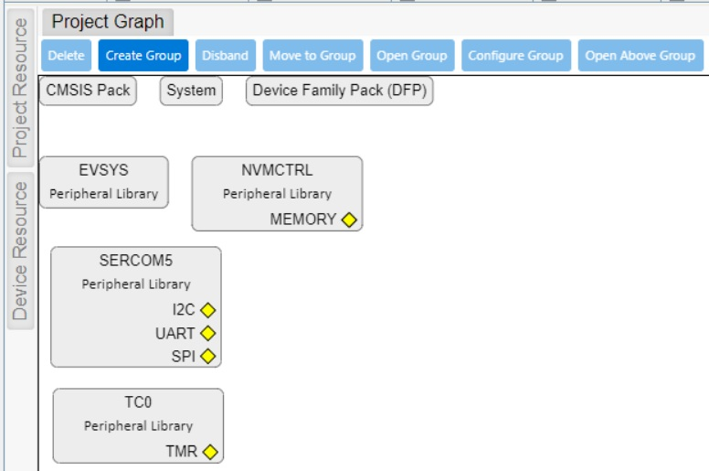

# i2cwrite - SAM E51 I2C Write Project

Demonstrates I2C write operations on the SAM E51 Curiosity Nano development board.

Based on the command_line project template, this project adds I2C peripheral configuration and demonstrates I2C master write functionality for communicating with I2C slave devices.

## Development Board
SAM E51 CURIOSITY NANO


### KIT-INFO.TXT
```
Debugger firmware:     01.1F.0027 (hex)
Kit name:              SAM E51 Curiosity Nano                                      
Kit USB serial number: MCHP3360023000003716
Device:                ATSAME51J20A                    
Drag and drop:         No 
```
### Evaluation Board Details
```
Part Number: EV76S68A
https://www.microchip.com/en-us/development-tool/ev76s68a

ARM® Cortex®-M4 processor - ATSAME51J20A
One user LED (yellow), active low,  PA14 (pin 31)
One user switch, active low,        PA15 (pin 32)
32,768Hz crystal                    PA00 XIN32, PA01 XOUT32
On-board debugger
Board identification in MPLAB X IDE
One power/status LED (green)
Virtual COM port (CDC)
One logic analyzer (DGI GPIO)
USB powered
Adjustable target voltage
MIC5353 LDO regulator controlled by the on-board debugger
1.8-3.6v output voltage
500 mA maximum output current (limited by ambient temperature and output voltage)
```
## Build Environment
```
MPLAB X IDE v6.25
Microchip XC32 Compiler v4.60
```

### SERCOM5 - Serial/CDC Port - Prewired for USB Serial Communication
```
SERCOM5 TX - PAD0 - PB16 (pin 39)
SERCOM5 RX - PAD1 - PB17 (pin 40)
```



### SERCOM3 - I2C Master Interface
```
SERCOM3 SDA - PAD0 - PA22 (pin 43)
SERCOM3 SCL - PAD1 - PA23 (pin 44)
```

### System Diagram


### Peripherals
```
TC0 - 32-bit counter, incrementing every 1us - Optional, supports microsecond timing
SERCOM5 - USART mode for USB CDC virtual serial port
SERCOM3 - I2C master mode for communicating with I2C slave devices
```

### Directory Structure
```
+-- curiosity_nano_same51j20a_command_line_i2cwrite
|   +-- i2cwrite.X                           | MPLAB X project directory
|   |   +-- i2cwrite_default                 | MCC Harmony configuration
|   |   |   +-- components                   | MCC component configurations
|   |   |   +-- mcc-config.mc4               | MCC project descriptor
|   |   +-- nbproject                        | MPLAB X project files
|   |       +-- configurations.xml           | Build configurations
|   |       +-- project.xml                  | Project definition
|   |       +-- Makefile-*.mk                | Build system makefiles
|   +-- src                                  | Source directory
|       +-- main.c                           | Application entry point
|       +-- config/default                   | MCC generated configuration
|       +-- logger.c                         | Implements printf() functionality via SERCOM5 TX
|       +-- logger.h                         | int log_msg(const char *fmt, ...);
|       +-- command_line.c                   | Interactive command line functionality
|       +-- command_line.h                   | Function prototypes
|       +-- version.h                        | Version string definition
|   +-- README.md                            | This file
|   +-- .gitignore                           | Git ignore patterns for MPLAB X 6.25
|   +-- CuriosityNanoBoard.jpg               | Curiosity Nano board image
|   +-- System_diagram.jpg                   | MCC Project Graph - system diagram
|   +-- SERCOM5_Configuration.jpg            | SERCOM5 configuration screenshot
|   +-- SERCOM5_Pins.jpg                     | SERCOM5 pinout screenshot
```

### What is this repository for?
```
SAM E51 Curiosity Nano Development Board (ATSAME51J20A)

This project demonstrates:
- I2C master mode write operations
- Interactive command line interface via USB CDC/Serial
- MCC Harmony 3 peripheral configuration
- Microsecond timing using TC0 32-bit timer
- Console logger functionality

Primary Use Case:
- I2C master communication with slave devices
- Command-driven I2C write operations
- Development template for I2C-based applications
```
   
### Help - Getting Started
```
https://www.microchip.com/en-us/tools-resources/configure/mplab-harmony
https://developerhelp.microchip.com/xwiki/bin/view/software-tools/harmony/archive/same54-getting-started-training-module/

```

### YouTube Videos
```
https://www.youtube.com/watch?v=wZlUVmyrH54

```

### Project Features
```
- I2C Master Mode (SERCOM peripheral configured for I2C)
- Interactive Command Line Interface
- USB CDC Virtual COM Port (SERCOM5 USART)
- Microsecond Timer (TC0 32-bit counter)
- Printf-style logging via SERCOM5
- MCC Harmony 3 code generation
```

### Version History
```
00.00.02 - Add I2C peripheral (SERCOM3 I2C master mode)
00.00.01 - Initial commit - i2cwrite project created from command_line template
```